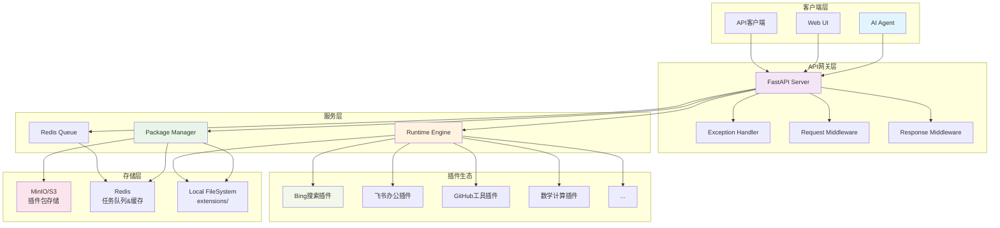
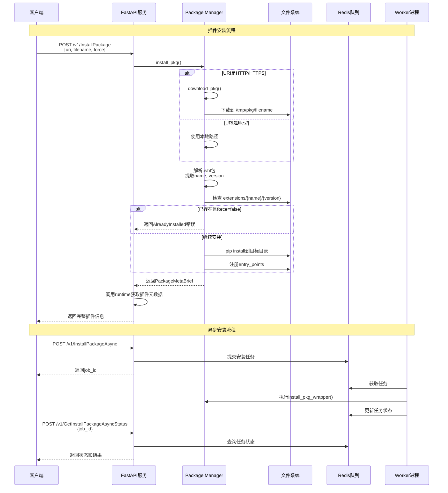
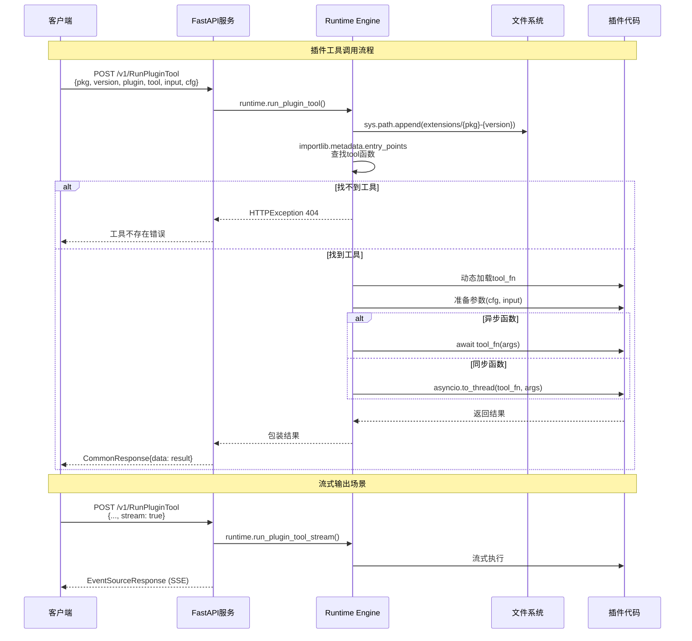
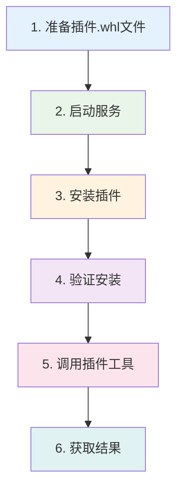

# 🚀 HiAgent Plugin Runtime 完整使用指南

## 📋 目录
1. [系统架构](#系统架构)
2. [服务启动](#服务启动)
3. [插件安装流程](#插件安装流程)
4. [插件使用流程](#插件使用流程)
5. [完整示例](#完整示例)

---

## 🏗️ 系统架构



### 🔧 核心组件说明

| 组件 | 职责 | 技术栈 |
|------|------|--------|
| **FastAPI Server** | HTTP API服务 | FastAPI + Uvicorn |
| **Package Manager** | 插件包管理 | pip + wheel + requests |
| **Runtime Engine** | 插件执行引擎 | importlib + asyncio |
| **Redis Queue** | 异步任务处理 | Redis + RQ |
| **Storage** | 数据持久化 | MinIO/S3 + Local FS |

---

## 🚀 服务启动

### 1. 环境准备

```bash
# 检查Python版本
python --version  # 需要 ≥ 3.11

# 安装依赖
poetry install

# 安装SDK
pip install -e ./hiagent-plugin-sdk
```

### 2. 配置文件

创建 `config.yaml`:
```yaml
version: 0.1.0
max_subprocess: 10
log_level: DEBUG

# Redis配置
redis:
  cluster_type: "single"
  host: "localhost"
  port: 6379

# 存储配置
storage:
  backend: "local_path"  # 或 "minio"
  local_path:
    base_dir: /tmp/hiagent_storage
  
# 插件包配置  
package:
  index_url: "https://pypi.org/simple"
```

### 3. 启动服务


**终端1 - 启动Redis**:
```bash
# 使用Docker启动Redis
docker run -d --name redis -p 6379:6379 redis:latest

# 或使用本地Redis
redis-server
```

**终端2 - 启动Worker进程**:
```bash
cd /path/to/plugin-runtime
CONFIG=config.yaml python worker.py
```

**终端3 - 启动API服务**:
```bash
cd /path/to/plugin-runtime  
CONFIG=config.yaml python main.py
```

**验证服务**:
```bash
# 检查API健康状态
curl http://localhost:8000/docs

# 检查Worker状态
curl http://localhost:8000/v1/health
```

---

## 📦 插件安装流程

### 完整安装流程图



### 🔧 安装命令示例

**同步安装**:
```bash
curl -X POST "http://localhost:8000/v1/InstallPackage" \
  -H "Content-Type: application/json" \
  -d '{
    "uri": "file:///path/to/hiagent_plugin_bingsearch-0.2.1-py3-none-any.whl",
    "filename": "hiagent_plugin_bingsearch-0.2.1-py3-none-any.whl",
    "force": true
  }'
```

**异步安装**:
```bash
# 1. 提交安装任务
curl -X POST "http://localhost:8000/v1/InstallPackageAsync" \
  -H "Content-Type: application/json" \
  -d '{
    "uri": "file:///path/to/plugin.whl",
    "filename": "plugin.whl",
    "force": false
  }'

# 返回: {"data": {"job_id": "abc-123"}}

# 2. 查询安装状态
curl -X POST "http://localhost:8000/v1/GetInstallPackageAsyncStatus" \
  -H "Content-Type: application/json" \
  -d '{"job_id": "abc-123"}'
```

---

## 🔧 插件使用流程

### 插件执行序列图



### 🎯 使用示例

**1. 基础工具调用**:
```bash
curl -X POST "http://localhost:8000/v1/RunPluginTool" \
  -H "Content-Type: application/json" \
  -d '{
    "pkg": "hiagent_plugin_bingsearch",
    "version": "0.2.1",
    "plugin": "Bing", 
    "tool": "search",
    "input": {
      "query": "Python机器学习教程"
    },
    "cfg": {
      "api_key": "your_bing_api_key"
    }
  }'
```

**2. 获取结构化结果**:
```bash
curl -X POST "http://localhost:8000/v1/RunPluginTool" \
  -H "Content-Type: application/json" \
  -d '{
    "pkg": "hiagent_plugin_bingsearch",
    "version": "0.2.1", 
    "plugin": "Bing",
    "tool": "search_results",
    "input": {
      "query": "FastAPI教程",
      "num_results": 5
    },
    "cfg": {
      "api_key": "your_bing_api_key"  
    }
  }'
```

**3. 流式输出**:
```bash
curl -X POST "http://localhost:8000/v1/RunPluginTool" \
  -H "Content-Type: application/json" \
  -d '{
    "pkg": "hiagent_plugin_openai",
    "version": "1.0.0",
    "plugin": "OpenAI",
    "tool": "chat_stream", 
    "input": {
      "messages": [{"role": "user", "content": "你好"}]
    },
    "stream": true,
    "cfg": {
      "api_key": "your_openai_key"
    }
  }'
```

---

## 🎬 完整示例

### 端到端使用流程



### 🚦 实际操作步骤

**Step 1: 准备环境**
```bash
# 克隆项目
git clone <plugin-runtime-repo>
cd plugin-runtime

# 安装依赖
poetry install
pip install -e ./hiagent-plugin-sdk

# 启动Redis
docker run -d --name redis -p 6379:6379 redis:latest
```

**Step 2: 启动服务**
```bash
# 终端1: 启动Worker
python worker.py &

# 终端2: 启动API服务  
python main.py &

# 验证服务
curl http://localhost:8000/docs
```

**Step 3: 安装插件**
```bash
# 下载或准备插件包
wget https://example.com/hiagent_plugin_bingsearch-0.2.1-py3-none-any.whl

# 安装插件
curl -X POST "http://localhost:8000/v1/InstallPackage" \
  -H "Content-Type: application/json" \
  -d '{
    "uri": "file:///path/to/hiagent_plugin_bingsearch-0.2.1-py3-none-any.whl",
    "filename": "hiagent_plugin_bingsearch-0.2.1-py3-none-any.whl", 
    "force": true
  }'
```

**Step 4: 验证插件**
```bash
# 检查插件是否安装成功
ls extensions/hiagent_plugin_bingsearch/0.2.1/

# 验证插件配置
curl -X POST "http://localhost:8000/v1/RunPluginValidate" \
  -H "Content-Type: application/json" \
  -d '{
    "pkg": "hiagent_plugin_bingsearch",
    "version": "0.2.1",
    "plugin": "Bing",
    "cfg": {"api_key": "test_key"}
  }'
```

**Step 5: 使用插件**
```bash
# 调用搜索功能
curl -X POST "http://localhost:8000/v1/RunPluginTool" \
  -H "Content-Type: application/json" \
  -d '{
    "pkg": "hiagent_plugin_bingsearch", 
    "version": "0.2.1",
    "plugin": "Bing",
    "tool": "search_results",
    "input": {
      "query": "人工智能发展趋势",
      "num_results": 3
    },
    "cfg": {
      "api_key": "your_real_bing_api_key"
    }
  }'
```

**Step 6: 处理响应**
```json
{
  "data": [
    {
      "snippet": "人工智能（AI）正在快速发展...",
      "title": "2024年人工智能发展趋势报告",
      "link": "https://example.com/ai-trends-2024"
    },
    {
      "snippet": "机器学习和深度学习技术...", 
      "title": "AI技术的未来展望",
      "link": "https://example.com/ai-future"
    }
  ],
  "error": null
}
```

### 🔄 常用管理操作

**插件管理**:
```bash
# 删除插件
curl -X POST "http://localhost:8000/v1/DeletePackage" \
  -d '{"pkg": "plugin_name", "version": "1.0.0"}'

# 获取插件元数据
curl -X POST "http://localhost:8000/v1/ReadPackageMetadata" \
  -d '{"uri": "file://path/to/plugin.whl", "filename": "plugin.whl"}'
```

**异步任务管理**:
```bash  
# 取消安装任务
curl -X POST "http://localhost:8000/v1/CancelInstallPackage" \
  -d '{"job_id": "task-id"}'

# 重试安装任务
curl -X POST "http://localhost:8000/v1/RetryInstallPackage" \
  -d '{"job_id": "task-id"}'
```

---

## 🎯 总结

HiAgent Plugin Runtime提供了完整的插件生命周期管理能力:

- **🔧 插件管理**: 安装、卸载、版本控制
- **⚡ 高性能执行**: 异步执行、流式输出  
- **🔄 异步处理**: Redis队列、任务状态管理
- **🛡️ 企业特性**: 错误处理、监控、配置管理
- **🌍 丰富生态**: 50+官方插件，涵盖办公、开发、AI等领域

通过这套系统，AI Agent可以轻松扩展各种第三方服务能力，实现真正的智能化任务执行！🚀